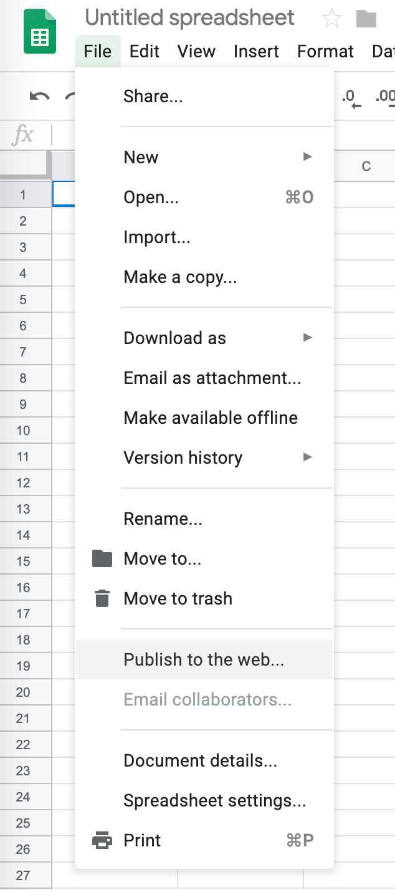
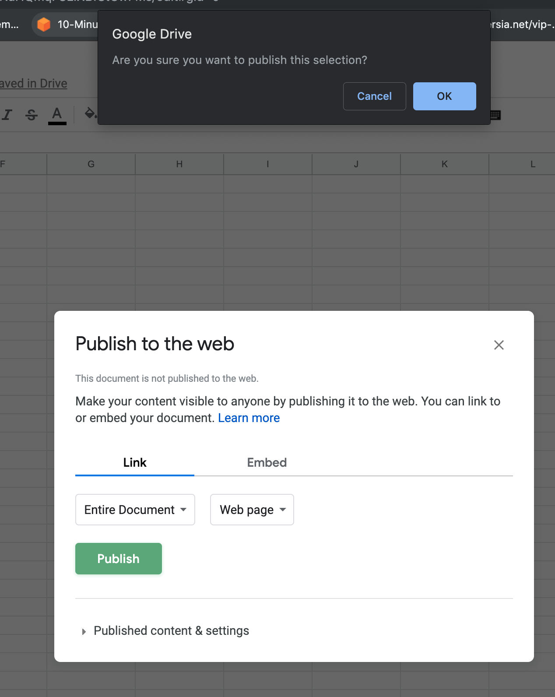
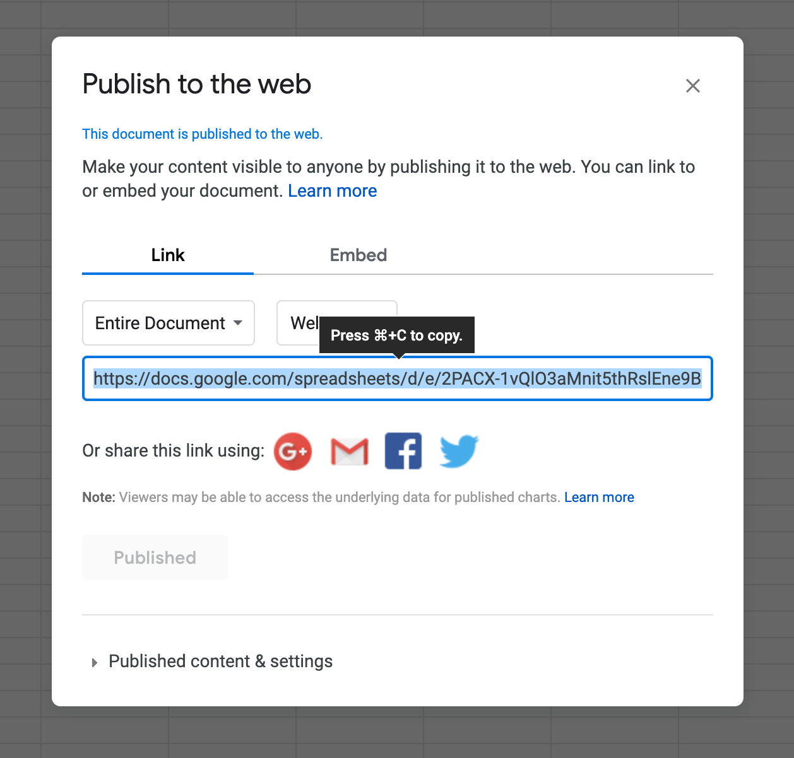

[![NPM version][npm-image]][npm-url]

# simple-spreadsheet-reader

A simple reader for a Google spreadsheet publish on web.

See documentation at [https://hubjac1.github.io/simple-spreadsheet-reader/](https://hubjac1.github.io/simple-spreadsheet-reader/)

## Usage

Install the module from npm with `npm install --save simple-spreadsheet-reader`

```typescript
import { SpreadsheedReader } from 'simple-spreadsheet-reader'

// Initialize the SpreadsheedReader with the speadsheet Id of URL
const spreadsheedReader = new SpreadsheedReader('spreadsheets-randomID')

// Load spreadsheed data from google.
await spreadsheedReader.loadSpreadsheetData()

// get one cell value
const cellA1 = spreadsheedReader.getCellValue('A1')
console.log('A1') // text

// get list of cells
const cells = spreadsheedReader.cellsList()
console.log(cells) 

// Compute Node elements of the table.
// In case of errors the node will contains the error message.
const tableElement = spreadsheedReader.getTable()

document.body.append(tableElement)
```
Result
```html
	 <table class="ssr-table">
			<thead>
			<tr>
				<td class="ssr-cell-head"></td>
				<td class="ssr-cell-head">A</td>
				<td class="ssr-cell-head">B</td>
			</tr>
			</thead>
			<tbody>
			<tr>
				<td class="ssr-cell-head">1</td>
				<td cell-id="A1" id="ssr-A1" class="ssr-cell-data">text</td>
				<td cell-id="B1" id="ssr-B1" class="ssr-cell-data">value</td>
			</tr>
			<tr>
				<td class="ssr-cell-head">2</td>
				<td cell-id="A2" id="ssr-A2" class="ssr-cell-data"></td>
				<td cell-id="B2" id="ssr-B2" class="ssr-cell-data">other</td>
			</tr>
			</tbody>
		</table>
```

### Publishing your Google Sheets to the web

Step 1:

Click File > Publish to the web…


Step 2:

Click Publish, then OK


Step 3:

Don't use the link from here.



But copy the URL or the spreadsheet ID form the sheet URL


### Common Error


If you receive the response below, please go back to Section 2: Publishing your Google Sheets to the web.


## Development


[npm-image]: https://badge.fury.io/js/ozone-typescript-client.svg
[npm-url]: https://npmjs.org/package/ozone-typescript-client

